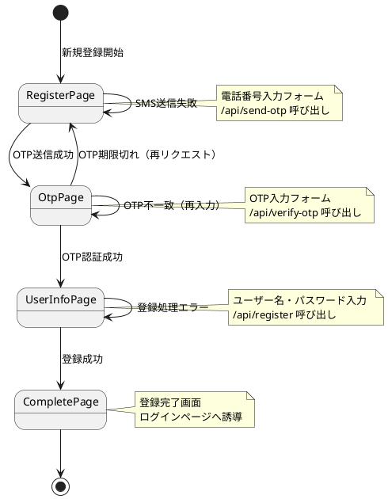

# AGENTS.md

## 🎯 ゴール
Next.js サイトに **電話番号認証（SMS OTP）** を組み込み、  
**新規登録時に電話番号を本人確認として利用する**。  

---

## 🔑 全体フロー
1. **電話番号入力 → OTP送信（/api/send-otp）**
2. **ユーザーがSMS受信 → OTP入力（/api/verify-otp）**
3. **OTP認証OK → アカウント登録（/api/register）**
4. **登録成功 → 完了ページ**

---

## 🧩 ページ設計と遷移
- **RegisterPage（新規登録ページ）**
  - 電話番号入力フォーム
  - `/api/send-otp` 呼び出し
  - SMS送信成功 → OTP入力ページへ
  - SMS送信失敗 → 同じページでエラー表示

- **OtpPage（OTP入力ページ）**
  - OTP入力フォーム
  - `/api/verify-otp` 呼び出し
  - OTP認証成功 → ユーザー情報入力ページへ
  - OTP不一致 → 同じページで再入力
  - OTP期限切れ → RegisterPageに戻る（再リクエスト可能）

- **UserInfoPage（ユーザー情報入力ページ）**
  - ユーザー名・パスワード入力フォーム
  - `/api/register` 呼び出し
  - 登録成功 → CompletePageへ
  - DB障害 → 同じページでエラー表示

- **CompletePage（登録完了ページ）**
  - 登録完了メッセージ
  - ログインページへの導線

---

## 📡 API仕様

### `/api/send-otp`
- **Request**
```json
{ "phone": "+819012345678" }
```
- **Response**
```json
{ "status": "sent" }
```
- **Plivo公式 Response例**
```json
{
  "message": "message(s) queued",
  "message_uuid": ["d264e8c6-xxxx"],
  "api_id": "d264e7bc-xxxx"
}
```

---

### `/api/verify-otp`
- **Request**
```json
{ "phone": "+819012345678", "code": "123456" }
```
- **Response**
成功:
```json
{ "status": "verified" }
```
不一致:
```json
{ "status": "invalid" }
```
期限切れ:
```json
{ "status": "expired_or_not_found" }
```

---

### `/api/register`
- **Request**
```json
{
  "phone": "+819012345678",
  "username": "taro",
  "password": "****"
}
```
- **Response**
```json
{ "status": "registered" }
```

---

## 🔒 判定ロジック
- OTPチェックは **期限切れ判定 → 一致判定** の順序で行うこと。  
- 不一致 → OTP入力ページに留まる。  
- 期限切れ → RegisterPageに戻る（再リクエスト可能）。  

---

## 📐 PlantUML（ページ遷移図）



---

## 🚨 注意点
- Plivoはプリペイド方式。残高が0になるとSMS送信はエラー。  
- 再送制御やレートリミットもフロント／サーバーで実装推奨。  
- OTP保存には本番では **DBまたはRedis** を利用すること。  
